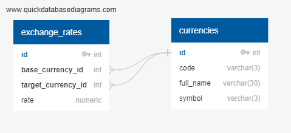

# Currency Exchange REST API Project


> Midjourney: computer to computer interface

Created according to the technical specifications presented
in [this course](https://zhukovsd.github.io/java-backend-learning-course/Projects/CurrencyExchange/)

# Overview

REST API for describing currencies and exchange rates.
Allows you to view and edit lists of currencies and exchange rates, and calculate conversions of any amount from one
currency to another.

## Technologies / tools used:

- JDBC
- Java Servlets
- Postman
- Maven
- Local PostgreSQL database

## Database diagram



## API features

> **Note**
> 
> Examples of requests to
> API on [Postman](https://www.postman.com/aerospace-administrator-4834442/workspace/workspace/api/06f46d32-08bf-4daa-ae89-8a156ca58aa4)

### Currencies

#### GET `/currencies`

Returns list of all currencies. Example of response:

```json
[
  {
    "id": 0,
    "name": "United States dollar",
    "code": "USD",
    "sign": "$"
  },
  {
    "id": 1,
    "name": "Euro",
    "code": "EUR",
    "sign": "€"
  },
  "..."
]
```

#### GET `/currency/USD`

Returns particular currency. The currency code is specified in the query address Example of response:

```json
[
  {
    "id": 0,
    "name": "United States dollar",
    "code": "USD",
    "sign": "$"
  }
]
```

#### POST `/currencies`

Adding a new currency to the database. Data is passed in the body of request in the x-www-form-urlencoded. The form
fields are `name`, `code`, `symbol`. Example of response (inserted record):

```json
[
  {
    "id": 2,
    "name": "Czech Koruna",
    "code": "CZK",
    "sign": "Kč"
  }
]
```

### Exchange rates

#### GET `/exchangeRates`

Returns list of all exchange rates. Example of response:

```json
[
  {
    "id": 0,
    "baseCurrency": {
      "id": 0,
      "name": "United States dollar",
      "code": "USD",
      "sign": "$"
    },
    "targetCurrency": {
      "id": 1,
      "name": "Euro",
      "code": "EUR",
      "sign": "€"
    },
    "rate": 0.93
  },
  {
    "id": 1,
    "baseCurrency": {
      "id": 0,
      "name": "United States dollar",
      "code": "USD",
      "sign": "$"
    },
    "targetCurrency": {
      "id": 2,
      "name": "Czech Koruna",
      "code": "CZK",
      "sign": "Kč"
    },
    "rate": 22.16
  },
  "..."
]
```

#### POST `/exchangeRates`

Adding a new exchange rate to the database. Data is passed in the body of request in the x-www-form-urlencoded. The form
fields are `baseCurrencyCode`, `targetCurrencyCode`, `rate`. Example of response (inserted record):

```json
[
  {
    "id": 2,
    "baseCurrency": {
      "id": 1,
      "name": "Euro",
      "code": "EUR",
      "sign": "€"
    },
    "targetCurrency": {
      "id": 2,
      "name": "Czech Koruna",
      "code": "CZK",
      "sign": "Kč"
    },
    "rate": 23.75
  }
]
```

#### GET `/exchangeRate/USDEUR`

Returns a particular exchange rate. The currency pair is specified by consecutive currency codes in the query address.
Example of response:

```json
[
  {
    "id": 0,
    "baseCurrency": {
      "id": 0,
      "name": "United States dollar",
      "code": "USD",
      "sign": "$"
    },
    "targetCurrency": {
      "id": 1,
      "name": "Euro",
      "code": "EUR",
      "sign": "€"
    },
    "rate": 0.93
  }
]
```

#### PATCH `/exchangeRate/USDEUR`

Updates the existing exchange rate in the database. The currency pair is specified by consecutive currency codes in the
query address. The data is passed in the body of the request in the x-www-form-urlencoded. The only form field
is `rate`.
Example of response (inserted record):

```json
[
  {
    "id": 1,
    "baseCurrency": {
      "id": 0,
      "name": "United States dollar",
      "code": "USD",
      "sign": "$"
    },
    "targetCurrency": {
      "id": 2,
      "name": "Czech Koruna",
      "code": "CZK",
      "sign": "Kč"
    },
    "rate": 22.24
  }
]
```

## Currency exchange

#### GET `/exchange?from=BASE_CURRENCY_CODE&to=TARGET_CURRENCY_CODE&amount=$AMOUNT`

Calculate the conversion of a particular amount of money from one currency to another. The currency pair and amount is
specified in the query address. Example of response:

```json
{
  "baseCurrency": {
    "id": 0,
    "name": "United States dollar",
    "code": "USD",
    "sign": "$"
  },
  "targetCurrency": {
    "id": 2,
    "name": "Czech Koruna",
    "code": "CZK",
    "sign": "Kč"
  },
  "rate": 22.24,
  "amount": 100.00,
  "convertedAmount": 2224.00
}
```
